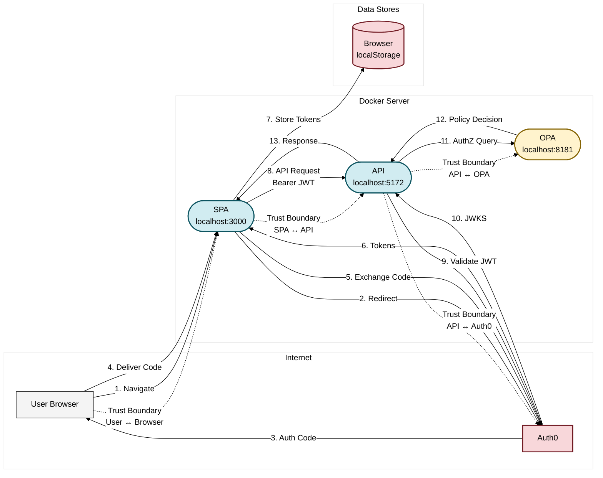

### Cyber security advanced: Bar Application

#### Moeilijkheden:
Tijden de implementatie van OPA was de request-body die vanuit de API moest komen weg en OPA had juist die payload nodig. dus men moest custom middleware maken om de body te bufferen en dit werkte niet samen de ASP.NET Core pipeline. Met de helper script PostBodyContextDataProvider vangt de API de body nu op en geven die veilig door aan de controller en het OPA-rego-script zo zit OPA er bij zonder de boel te breken. Dit was ook mogelijk met dank aan de lector die ondersteuning bracht.

#### Implementatie

##### Middleware Registration:
 ```c++
var opaUrl = "http://opa:8181";
var opaClient = new OpaClient(opaUrl);

app.UseAuthentication();
app.UseMiddleware<OpaAuthorizationMiddleware>(opaClient, "system/main");
 ```


##### Custom Helper for Policy Evaluation:
Dit was gegeven door de lector en in het eind resultaat gebruikt. Deze code snippet van PostBodyContextDataProvider leest body uit, reset de positie en stopt inhoud in context.data.requestBody.

```c++
public class PostBodyContextDataProvider : IContextDataProvider
{
    public object GetContextData(HttpContext context)
    {
        var contextData = new Dictionary<string, object>();
        
        try
        {
            context.Request.EnableBuffering();
            context.Request.Body.Position = 0;
            
            var bodyContent = ReadRequestBodyAsync(context.Request.Body).GetAwaiter().GetResult();
            context.Request.Body.Position = 0;
            
            contextData["requestBody"] = bodyContent;
        }
        catch (Exception ex)
        {
            contextData["requestBodyError"] = ex.Message;
        }
        
        return contextData;
    }
}
```

##### Alternative Custom OPA middleware (niet gebruikt in de opdracht):
Deze versie heeft veer onderliggende gelijkenissen maar is minder efficient en ordelijk. Deze code snippet kan body wel lezen naar OpaMiddleware, maar breekt code structuur. 

```c++
app.UseMiddleware<OpaMiddleware>();

public sealed class OpaMiddleware(RequestDelegate next, OpaClient opa, ILogger<OpaMiddleware> log)
{
    public async Task InvokeAsync(HttpContext ctx)
    {
        ctx.Request.EnableBuffering();
        var bodyText = await new StreamReader(ctx.Request.Body).ReadToEndAsync();
        ctx.Request.Body.Position = 0;

        object body = bodyText;
        try { body = JsonConvert.DeserializeObject(bodyText) ?? bodyText; } catch { /* nothing */ }

        var input = new
        {
            method  = ctx.Request.Method,
            path    = ctx.Request.Path.Value,
            user    = ctx.User?.Identity?.Name ?? "anonymous",
            body,
            headers = ctx.Request.Headers.ToDictionary(h => h.Key, h => h.Value.ToString())
        };

        dynamic res = await opa.EvaluateDefault<dynamic>(input);

        bool allowed = res is bool b ? b : res?.decision == true || res?.allow == true;

        if (!allowed)
        {
            ctx.Response.StatusCode = 403;
            await ctx.Response.WriteAsync("Forbidden: Access denied by policy");
            return;
        }

        log.LogInformation("OPA allowed {Method} {Path}", ctx.Request.Method, ctx.Request.Path);
        await next(ctx);
    }
}
```


##### Rego Access Control:
Het juiste stuk json zoeken om te valideren was lastiger door de hoeveelheid data. 
Deze code van Rego geeft toegang op basis van request body, roles en leeftijd namelijk als men 16 jaar is voor bier en fristi voor iedereen. 
```r
package system

main := {"decision": true} if {
    input.resource.id == "/api/bar"
    body := json.unmarshal(input.context.data.requestBody)
    body.DrinkName == "Beer"
    
    some role_claim in input.subject.claims
    role_claim.Type == "http://schemas.microsoft.com/ws/2008/06/identity/claims/role"
    role_claim.Value == "Customer"
    
    some age_claim in input.subject.claims
    age_claim.Type == "age"
    age := to_number(age_claim.Value)
    age >= 16
}

main := {"decision": true} if {
    input.resource.id == "/api/bar"
    body := json.unmarshal(input.context.data.requestBody)
    body.DrinkName == "Fristi"
    
    some role_claim in input.subject.claims
    role_claim.Type == "http://schemas.microsoft.com/ws/2008/06/identity/claims/role"
    role_claim.Value == "Customer"
}
```

---

## STRIDE Thread modelling

### Assets

| A01 | Gebruikersreferenties en persoonlijke gegevens   |
| :-- | :----------------------------------------------- |
| A02 | JWT toegangstokens en vernieuwingstokens         |
| A03 | API endpoints en bedrijfslogica                  |
| A04 | Leeftijdsgevoelige operaties (alcohol bestellen) |

### Threats and Threat Actors

| TA01 | Niet-geauthenticeerde externe gebruiker |
| ---- | --------------------------------------- |
| TA02 | Niet-geauthenticeerde interne gebruiker |
| TA03 | Kwaadwillende Klant                     |
| TA04 | Kwaadwillende Barman                    |
| TA05 | Aanvaller met gejailbreakt apparaat     |

### Threats or Attack Vectors:

| T01 | Afluisteren via kabeltapping                                |
| --- | ----------------------------------------------------------- |
| T02 | Afluisteren via ARP poisoning (MITM)                        |
| T03 | Injectie aanval (XSS/NoSQL injectie)                        |
| T04 | Token diefstal via XSS of CSRF                              |
| T05 | Replay aanvallen                                            |
| T06 | Sessie kaping                                               |
| T07 | Leeftijdsverificatie omzeiling via request body manipulatie |
| T08 | CORS misconfiguraties                                       |

---

## Voor OAuth en OPA Implementatie


### Originele Beveiligingsmaatregelen

| B01 | **Geen authenticatie geïmplementeerd**           |
| --- | ------------------------------------------------ |
| B02 | **Minimale invoervalidatie**                     |
| B03 | **Geen digitale handtekeningen geïmplementeerd** |
| B06 | **Geen rate limiting of DoS bescherming**        |

### Bevellings problemen
- Geen authenticatiemechanisme aanwezig
- Autorisatie attributen uitgecommentarieerd in controllers
- Zeer beperkte invoervalidatie
- Geen rate limiting middleware
- Geen digitale handtekeningen voor non-repudiation

---

## Na OAuth en OPA Implementatie



### Nieuwe Beveiligingsmaatregelen

| B01 | **Authenticatie (OAuth 2.0/OIDC via Auth0)**                     |
| --- | ---------------------------------------------------------------- |
| B02 | **Autorisatie via OPA beleidsregels (rol & leeftijd gebaseerd)** |
| B03 | **Invoervalidatie en sanitization (basis)**                      |
| B04 | **JWT token validatie**                                          |
| B06 | **Request body inspectie voor leeftijdsverificatie**             |
| B07 | **rate limiting of DoS bescherming door Oauth**                  |
| B08 | berijd tot audits via Oauth                                      |

### Bevellings oplossingen
- OAuth 2.0 integratie met Auth0
- OPA voor autorisatie
- Leeftijd-gebaseerde beperkingen voor alcohol bestellingen 
- JWT Bearer token authenticatie
- Request body context voor beleidsbesluiten

---

### Problemen opgelost door OAuth

**Authenticatie**  
- User Authentication: Oauth laat onze users valideren zonder het wachtwoorden lokaal te bewaren.
- Single Sign-On: 1 keer inloggen voldoet voor alle aangesloten applicaties: 
   => Minder wachtwoorden invullen = minder risico.

**Autorisatie**  
- Access Tokens: korte afneem en vernieuw-bare tokens die langlevende creds vervangen.  

**Security**  
- JWT-basis: tokens in plaats van stateful sessions.  
- Geen wachtwoordverkeer met de app = minder kans op credential leaks.  
- Standaard OAuth2: breed ondersteund en berijd tot audits.

### Problemen opgelost door OPA

**Policy Enforcement**  
- Centraal beleid: alle Rego-regels staan op één plek, consistent over services.  
- Dynamische evaluatie: beslissingen op basis van live context zoals user attributen, body data en headers.

**Autorisatie**  
- Separation of Concerns: policy wijzigen zonder code opnieuw moeten deployen.

**Security**  
- Gedeelde beveiligingsmaatregelen zorgt voor geen gaten tussen microservices.  

**Schaalbaarheid**  
- Gemakkelijk schaalbaarheid door het creëren van middleware tussen front en back-end.  
- Rego is declarative en eenvoudig uit te breiden.
